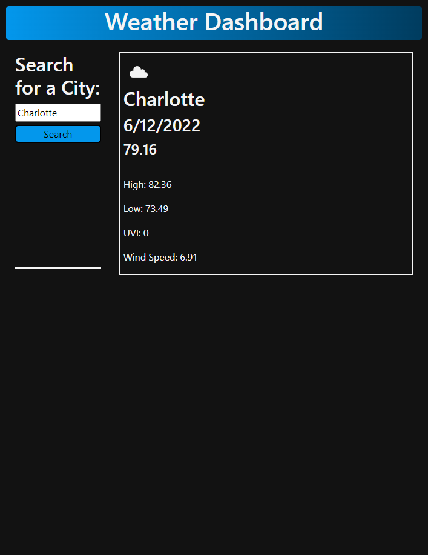

# Weather Dashboard (In-progress)

## Description

A web dashboard built with HTML, CSS, and Javascript, where you can search for city by its name and the current day's weather will generate using the OpenWeather API, showing an icon for the current conditions along with the current temperature, the high and low temperature for the day, the UV Index, and the Wind Speed.

## Work In Progress

This is still a work in progress. A later update will show a 5 day forecast of the city searched with each day's date, an icon for the forecasted conditions for each day, the average temps, wind speed, and humidity. Secondly, buttons will be added to store past searches under the search button. These historical buttons will be labeled with the city of the historical search. Lastly, the styling will be updated to provide a more polished viewing experience while using the dashboard.

## Steps Taken

* Basic foundation and styling added to the dashboard using HTML and CSS, along with minor tweaks using Bootstrap CSS.

* Present day weather and data fetched from the OpenWeather API.

## Webpage

Link: https://stricker2.github.io/weather-dashboard/ 

## Contributors

Project created by Andrew Secore